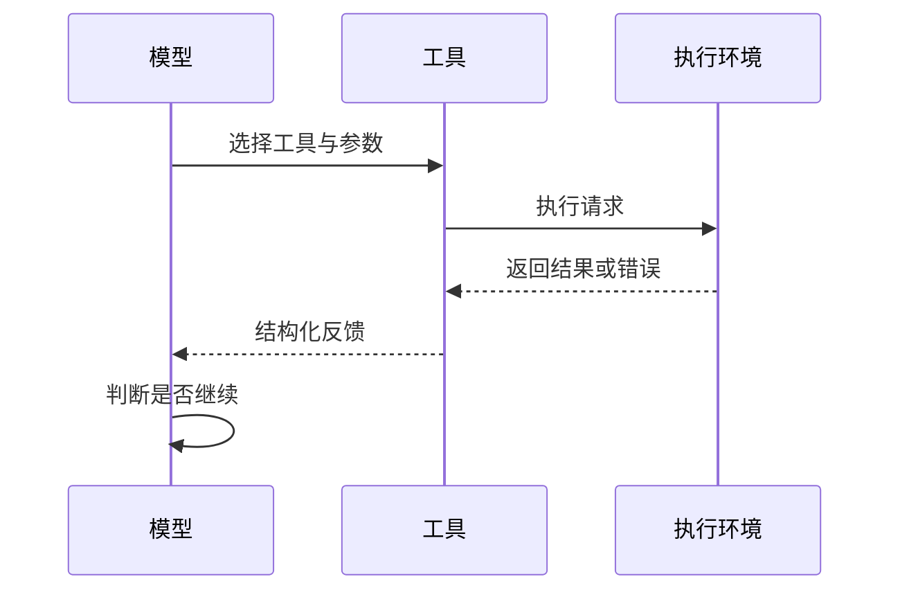

# Agent 与工具调用

Agent 工作流通常由模型决策、工具执行、结果反馈和下一轮决策组成。工具不是模型能力的简单延伸，而是带有权限、失败和副作用的外部边界。

## 最小闭环

## 工程边界

- 明确工具的输入、输出和权限范围。
- 对失败、超时和部分成功定义处理方式。
- 对写入、删除、发送消息等副作用增加确认或审计。
- 用可重复的评估样例验证 Agent 行为，而不是只验证单次成功。
