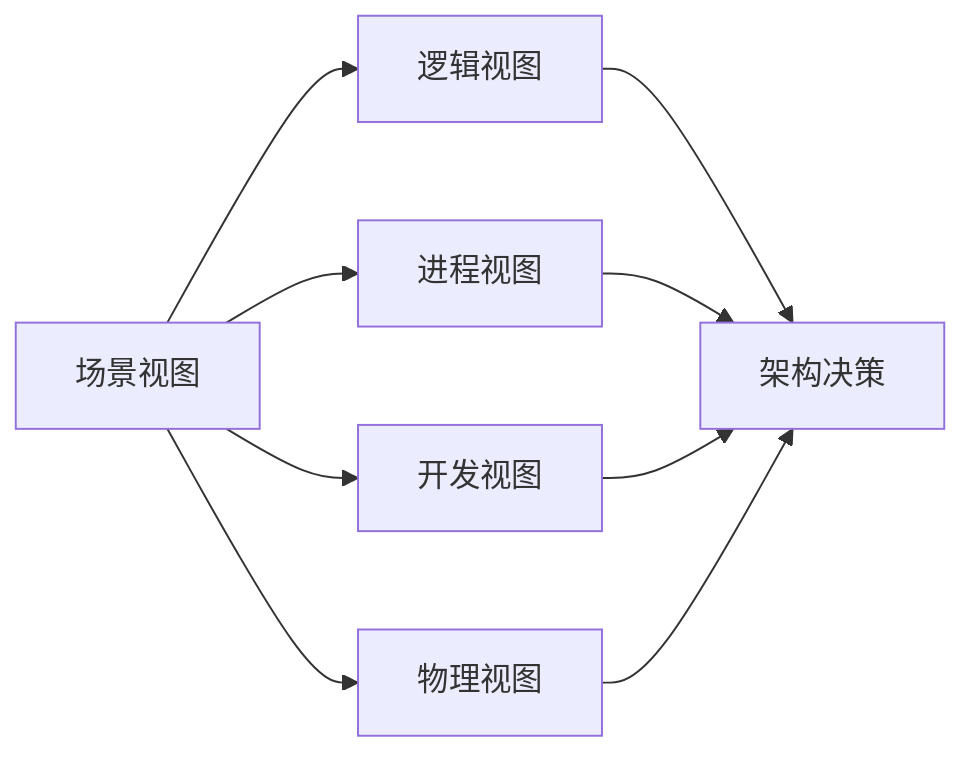

# 架构视图

一个系统很难用一张图讲清楚。不同视图服务于不同问题：谁负责什么、如何运行、部署在哪里，以及关键场景如何完成。

```mermaid
flowchart LR
  S[场景视图] --> L[逻辑视图]
  S --> P[进程视图]
  S --> D[开发视图]
  S --> Ph[物理视图]
  L --> C[架构决策]
  P --> C
  D --> C
  Ph --> C
```

## 4+1 视图

- 逻辑视图：核心领域对象和职责。
- 开发视图：模块、代码组织和依赖关系。
- 进程视图：运行时并发、通信和资源隔离。
- 物理视图：节点、网络和部署关系。
- 场景视图：用例和关键流程，连接其他四个视图。
