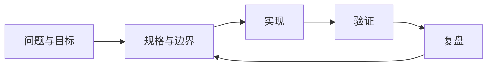

# Vibe Coding 工作流

一个可维护的 AI 协作流程应该让每一步都有输入、输出和下一步决策依据。

```mermaid
flowchart LR
  I[问题与目标] --> S[规格与边界]
  S --> E[实现]
  E --> V[验证]
  V --> R[复盘]
  R --> S
```

## 每轮交互的最小信息

- 目标和非目标。
- 相关文件和现有约束。
- 可观察的验收标准。
- 当前已经尝试过的方案和结果。

反馈越具体，下一轮生成越容易收敛。
